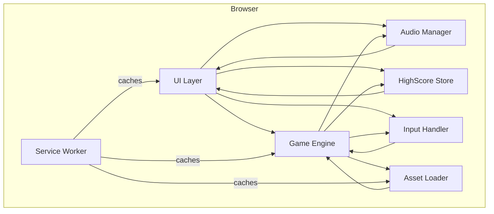

# Architect Mission Report

**Agent**: architect  
**Generated**: 2026-08-06T09:02:05.242Z

---

## Architecture Style

Modular Monolith (single-page client application)

## Components

- **UI Layer** (Presentation): Renders start screen, countdown, HUD (score, lives, high score), pause overlay, level‑complete and game‑over screens. Handles menu navigation and focus indicators for accessibility.
- **Game Engine** (Core Logic): Main game loop running at 60 fps, manages game state, collision detection, maze layout, ghost AI, level progression, scoring and lives.
- **Input Handler** (Input): Normalizes keyboard (arrow keys, WASD), touch swipe, and on‑screen button events into directional commands for the engine.
- **Audio Manager** (Service): Loads, caches and plays all sound effects and background music, supports mute toggle and dynamic pitch change for the siren.
- **Asset Loader** (Service): Pre‑loads sprite sheets, tile maps, and audio files before gameplay starts and provides them on demand.
- **HighScore Store** (Persistence): Stores the top‑10 high scores (initials + points) in IndexedDB, exposes CRUD‑style API to UI and Engine, works offline.
- **Service Worker** (Infrastructure): Caches all static assets (HTML, JS, CSS, images, audio) for offline‑first operation, updates cache on new deployments.

## Tech Stack

- **Frontend Framework / Library**: Plain TypeScript + Canvas (no heavy framework) — A lightweight, framework‑less approach keeps the bundle under 2 MB, eliminates unnecessary runtime overhead, and gives direct control over the game loop and rendering. React would add ~150 KB gzipped and complicate the real‑time loop; PixiJS is powerful but overkill for a simple 2D tile‑based game.
- **Build Tool**: Vite — Vite provides lightning‑fast dev server start‑up, native ES‑module support, and built‑in support for TypeScript and Workbox. Webpack is more configurable but slower to start; Parcel is zero‑config but offers less fine‑grained control over caching and bundle analysis.
- **Language**: TypeScript — TypeScript adds static typing, which reduces bugs in complex game‑state logic and improves IDE support. Plain JavaScript lacks type safety; Elm offers strong guarantees but introduces a new paradigm and larger runtime size.
- **Asset Management / Offline Support**: Workbox (via Vite plugin) — Workbox abstracts common caching strategies, generates a service worker automatically, and integrates with Vite's build pipeline. Writing a custom SW is error‑prone; sw-precache is deprecated in favor of Workbox.
- **Persistence**: IndexedDB via idb library — IndexedDB handles structured data and larger payloads without blocking the main thread. LocalStorage is synchronous and limited to ~5 MB, unsuitable for future extensions; WebSQL is deprecated and not supported in all browsers.
- **Audio**: Web Audio API (native) — Web Audio API provides low‑latency playback, precise volume/pitch control, and works offline. <audio> element adds latency and limited control; Howler.js wraps Web Audio but adds extra kilobytes, unnecessary for a small set of sounds.
- **Styling**: CSS Modules — CSS Modules give scoped styles without runtime overhead, keeping the bundle small. Plain CSS works but risks global leaks; Tailwind adds a large utility class set increasing bundle size.
- **Testing**: Jest + @testing-library/dom — Jest is mature, fast for unit tests, and integrates well with Vite. @testing-library/dom encourages testing from the user’s perspective. Vitest is newer but less ecosystem support; Cypress is great for end‑to‑end but adds more setup for a primarily logic‑driven game.
- **CI/CD**: GitHub Actions — GitHub Actions runs directly on the repository host, offers free minutes for open source, and can build, test, and deploy to Netlify in a single workflow. GitLab CI requires a separate platform; CircleCI adds external service complexity.
- **Hosting**: Netlify (static site hosting) — Netlify provides built‑in CDN, automatic HTTPS, and easy integration with GitHub Actions for continuous deployment. GitHub Pages lacks custom headers needed for service workers; Cloudflare Pages is comparable but Netlify’s UI for redirects and environment variables is more straightforward.

## Epics

- **EPIC-001** Core Gameplay Engine: Implement the main game loop, maze representation, collision detection, dot and pellet consumption, scoring, lives, level completion, and difficulty scaling.
- **EPIC-002** Input System: Capture keyboard, WASD, arrow keys, touch swipe gestures, and on‑screen directional buttons; translate them into movement commands for the engine.
- **EPIC-003** Ghost AI & Behavior: Implement four distinct ghost personalities, chase/scatter timer logic, scared state handling, eye‑return animation, and point escalation for successive ghosts.
- **EPIC-004** Audio System: Load and play all required sound effects and background siren, support mute toggle, and adjust siren pitch based on remaining dots.
- **EPIC-005** User Interface & HUD: Create start screen, countdown, in‑game HUD (score, high score, lives), pause overlay, level‑complete transition, and game‑over screen with high‑score entry.
- **EPIC-006** High Score Persistence: Store top‑10 scores with player initials in IndexedDB, load them on startup, and update after each game over.
- **EPIC-007** Offline‑First Support: Cache all static assets (HTML, JS, CSS, images, audio) via a service worker so the game loads and runs without an internet connection.
- **EPIC-008** Accessibility & Color‑Blind Mode: Ensure full keyboard navigation, visible focus indicators, ARIA labels for menus, and a toggle that swaps ghost colors to a color‑blind‑friendly palette.
- **EPIC-009** Responsive Layout & Mobile Controls: Make the canvas resize gracefully across phones to large monitors, add on‑screen directional buttons for touch devices, and ensure swipe gestures work reliably.
- **EPIC-010** Level Progression & Difficulty Scaling: Create at least 20 levels with incremental speed increases for ghosts, shorter scared timers, and altered chase/scatter ratios; loop after level 20.

## Architecture Diagram

