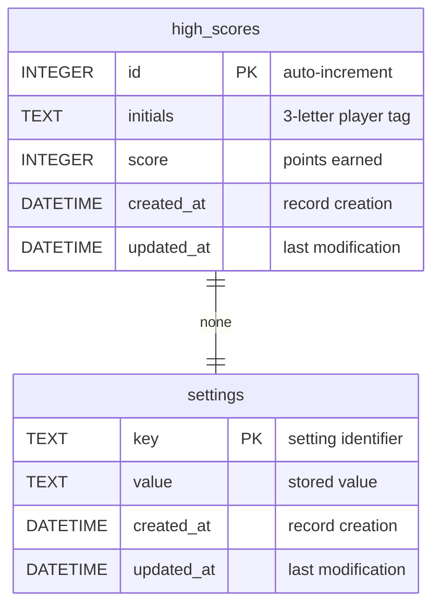

# DBA Mission Report

**Agent**: dba  
**Generated**: 2026-08-06T09:02:57.139Z

---

## Database Engine: IndexedDB (via idb library)

The application runs entirely in the browser and the only persistent data required is the top‑10 high scores (and a few user preferences). IndexedDB provides a fast, asynchronous, client‑side NoSQL key‑value store that works offline, integrates seamlessly with the idb wrapper used in the codebase, and does not require any server component. It satisfies the offline‑first requirement and matches the tech stack decision.

## Entities (2)

- **high_scores**: 5 columns
- **settings**: 4 columns

## ERD

